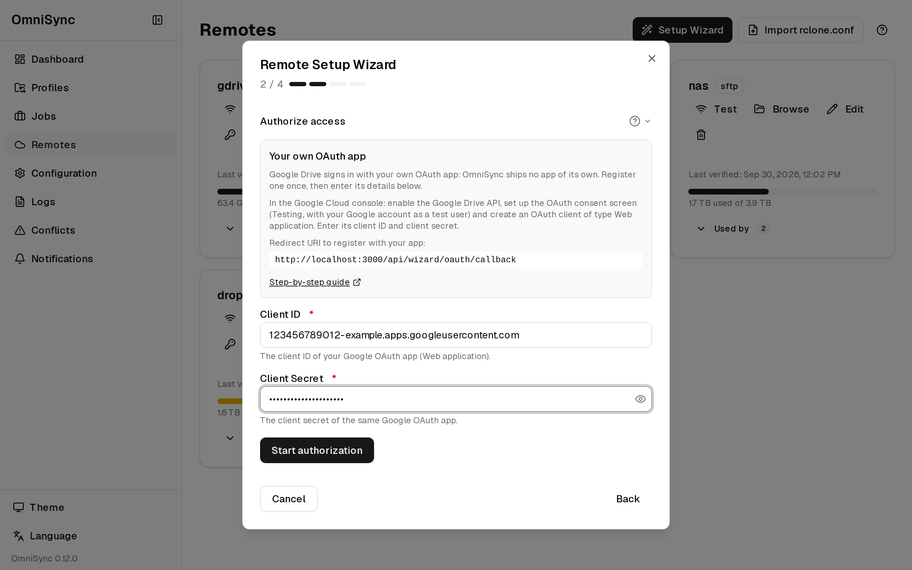
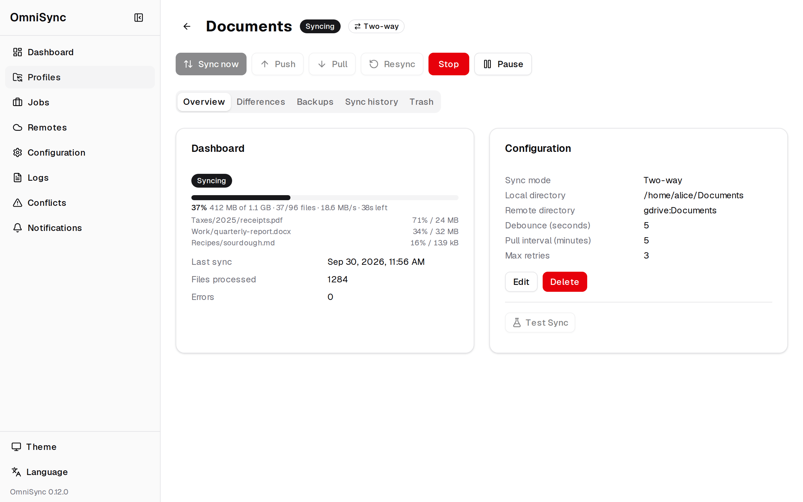
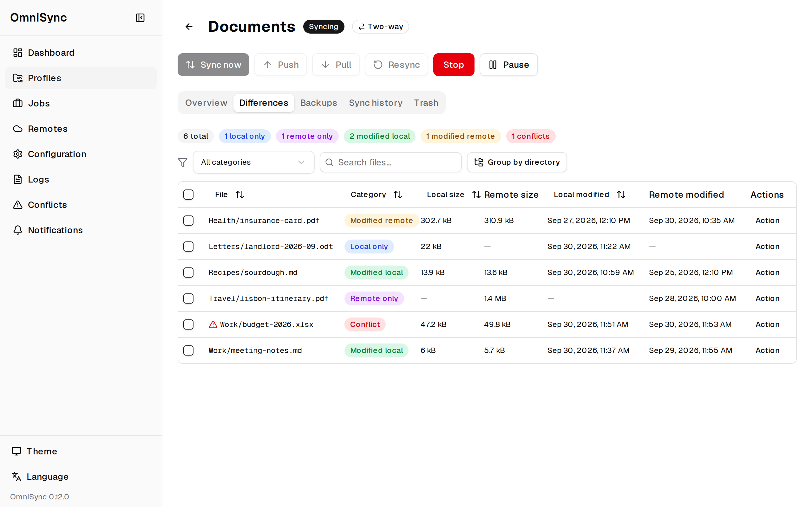
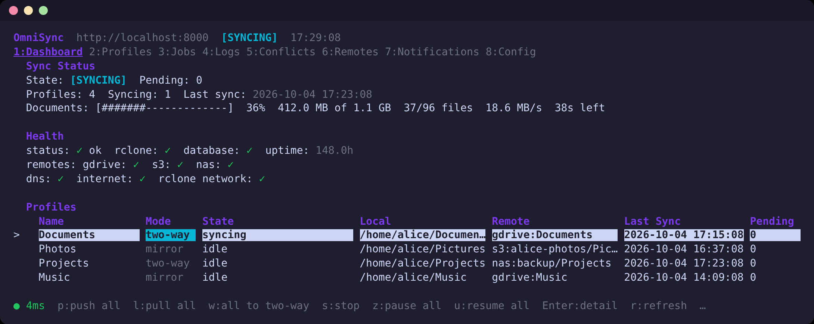

# Getting Started with OmniSync

## 1. Install

You need Docker with the compose plugin, on Linux, macOS or Windows (WSL 2
with Docker Desktop), on x86-64 or 64-bit ARM. OmniSync runs as two
containers: the backend (the sync server, with rclone inside) and the web
UI.

### With the installer (recommended)

```bash
curl -fsSL https://raw.githubusercontent.com/pan-fire/OmniSync/main/scripts/install.sh | bash
```

To read it before it runs: download it (`curl -fsSLO` with the same
address), look through `install.sh`, try `bash install.sh --dry-run`, then
`bash install.sh`.

It checks your system (Docker, the compose plugin, free ports 3000 and
8000), asks for the folder OmniSync may sync (default `~/OmniSync`) and
whether to protect the web UI with a password, then:

- puts the latest release's `compose.yml` (checked against the release's
  checksums) and a `.env` with your settings into `~/omnisync`;
- generates the API token, so the web UI can reach the backend;
- pulls the images, starts both containers and waits until they are
  healthy;
- prints the address of the web UI and what to do next.

Without a terminal (e.g. in a provisioning script) add `--yes` to take the
defaults: `curl -fsSL ... | bash -s -- --yes --sync-dir /srv/sync`.
`bash install.sh --help` lists every option, and
[Operations](operations.md#install-update-and-uninstall-with-the-installer)
explains updating and removing it. Then continue with
[step 2](#2-add-a-cloud-remote).

### Or: build from the source

```bash
git clone https://github.com/pan-fire/OmniSync.git
cd OmniSync
cat > .env <<EOF
OMNISYNC_API_TOKEN=$(openssl rand -hex 32)
OMNISYNC_SYNC_DIR=$HOME/Sync
PUID=$(id -u)
PGID=$(id -g)
TZ=$(cat /etc/timezone 2>/dev/null || echo UTC)
EOF
mkdir -p ~/Sync
docker compose up -d --build
```

What the settings in `.env` mean:

- **`OMNISYNC_API_TOKEN`**: the password for the OmniSync API. The web UI's
  server uses it automatically; the terminal UI needs it too (see below).
- **`OMNISYNC_SYNC_DIR`**: the folder on your machine that OmniSync may sync.
  Every profile's local folder must be inside it (here: `~/Sync/Documents`,
  `~/Sync/Photos`, ...). It appears inside the container under the same path.
  For folders elsewhere, add more mounts in a `docker-compose.override.yml`.
- **`PUID` / `PGID`**: your user and group id, so files that OmniSync pulls
  from the cloud belong to you. Never `0`: that would run OmniSync as root.
- **`TZ`**: your time zone (e.g. `Europe/Berlin`), for log times and
  schedules; `UTC` if unset.

The web UI is now at <http://127.0.0.1:3000> and the API at
`http://127.0.0.1:8000`, both reachable only from this machine.

### Or: run a released version by hand

The commands above build the images from the source. Each release also
publishes ready-built images, `ghcr.io/pan-fire/omnisync-backend` and
`ghcr.io/pan-fire/omnisync-web`, tagged with the version (e.g. `1.2.3`),
the minor line (`1.2`) and `latest`.
To use them, create the same `.env` with one more line,
`OMNISYNC_VERSION=<version>` (the latest release, from the
[releases page](https://github.com/pan-fire/OmniSync/releases)), save the
compose file from the README's
[Install a release](../../README.md#images-with-docker-compose) next to it
as `compose.yml`, and run `docker compose up -d`. Use the same
version for both images. They run on x86-64 and on 64-bit ARM (a Raspberry
Pi 4/5 with a 64-bit OS, most current NAS models). To check that the images
are genuine before you run them, see the README's
[Verify a release](../../README.md#verify-a-release).

Without Docker: [Operations](operations.md#running-without-docker) shows how
to run the backend and the web UI as systemd services.

To upgrade later (installed with the installer: just run it again), read
the [changelog](../../CHANGELOG.md), change
`OMNISYNC_VERSION` and run `docker compose pull && docker compose up -d`.
Your profiles, remotes and history stay in the `omnisync-data` volume, and
database changes are applied on start. The version you are running is shown
at the foot of the web UI's sidebar.

## 2. Add a cloud remote

1. Open <http://127.0.0.1:3000> and go to **Remotes**.
2. Click **Setup Wizard**, pick your provider and give the remote a name
   (e.g. `gdrive`).
3. Key-based providers (Amazon S3, Backblaze B2, SFTP, FTP, WebDAV, SMB)
   ask for their keys or login; **Next** creates the remote. For an
   encrypted folder, first add the remote that will hold it, then a
   **crypt** remote: pick that remote and a folder, and choose a password
   (write it down; without it the files cannot be decrypted).
4. OAuth providers (Google Drive, OneDrive, Dropbox) sign in with **your
   own OAuth app**: OmniSync ships no client IDs or secrets. Register the
   app once with the provider, as [Cloud Remotes](remotes.md) describes
   step by step for each of them, with the redirect URI the wizard shows
   (the address you open the web UI with plus
   `/api/wizard/oauth/callback`, e.g.
   `http://127.0.0.1:3000/api/wizard/oauth/callback`). In the wizard, enter
   the app's client ID (Google Drive: and its client secret; Dropbox and
   OneDrive need none), click **Start authorization**, then **Open
   authorization URL** and approve access in the new tab. The provider
   sends the tab back to OmniSync, the sign-in finishes by itself and the
   wizard creates the remote. The access token is stored on the server in
   OmniSync's own rclone config and never shown to the browser.
5. The wizard tests the new remote and reports "Remote configured
   successfully!".



Already using rclone? **Import rclone.conf** on the Remotes page adds your
existing remotes instead (see the FAQ). Later, **Edit** on a remote's card
changes its keys or login, and **Reconnect** renews an expired Google
Drive, Dropbox or OneDrive sign-in.

**The redirect URI.** The provider returns the browser to the web UI, so
sign in with a browser that can reach it, and register the address exactly
as the wizard shows it (scheme, host, port and path). Behind another
reverse proxy, set `OMNISYNC_OAUTH_REDIRECT_URI` to the address the browser
reaches the callback at, and register that. A sign-in is valid for about
ten minutes; if it fails, click **Retry** and sign in again.

**Remotes from rclone's built-in apps.** A remote created with rclone's
built-in app (made with `rclone config` and imported from an rclone.conf) has
no client ID of its own. It keeps working: rclone refreshes its token with
its own app. **Reconnect** on such a remote needs your own app, which it
then stores in the remote. rclone is retiring its shared Google Drive app
during 2026, so move Drive remotes to your own app before then.

The sign-ins have not been tested against the real providers yet.

## 3. Create a sync profile

Go to **Profiles** and create a profile:

- **Name**: anything with at least one letter or digit.
- **Local folder**: pick a folder inside `OMNISYNC_SYNC_DIR`. OmniSync never
  creates a missing local folder; create it first.
- **Remote folder**: the remote name, a colon, and a path, e.g.
  `gdrive:Sync/Documents`.
- **Sync mode**: **Two-way (recommended)**, the default, or **Mirror:
  one-way push/pull only**. Two-way carries changes from either side to the
  other and keeps both versions of a file changed on both sides; mirror
  pushes local changes and pulls the cloud on the interval, so the side that
  syncs last wins. See [Sync modes](configuration.md#sync-mode).

The other settings have sensible defaults; see the
[Configuration Guide](configuration.md).

## 4. Your first sync

### Two-way profiles

A new two-way profile syncs as soon as it starts. Its first sync is a
**resync**: OmniSync writes a small marker file, `.omnisync-check`, to both
folders, then makes both folders the union of the two. A file that exists
on only one side is copied to the other, nothing is deleted, and where a
file exists on both sides with different content, the newer version wins
and the older one is moved to `.omnisync-trash/<timestamp>/` on its side.

**Sync now** on the profile's page starts a two-way sync by hand. The
**Sync now** button on the Dashboard (and on a paused profile) asks first;
its confirmation lists per side how many files would be deleted, replaced
or newly copied, how many files changed on both sides, and whether the run
is a resync.



### Mirror profiles

When a mirror profile starts, OmniSync first compares both sides. If there
is anything to sync (and for a new profile there usually is), the profile
is **paused**: nothing is pushed or pulled automatically until you have
looked at the differences.

1. Open the profile and go to the **Differences** tab. It lists every file
   that exists on only one side or differs, without changing anything.
2. Tick the files and choose **Push selected** (local to cloud) or **Pull
   selected** (cloud to local). With **Group by directory**, a folder's
   **Action** menu offers **Push all** / **Pull all**.
3. When nothing is left, click **Resume Intervals**.



After the first successful full push or pull, OmniSync writes the marker
file `.omnisync-check` to both folders.

### Push and Pull (both modes)

The **Push** and **Pull** buttons sync the whole folder one way: push makes
the cloud folder an exact copy of your local folder, pull the reverse. They
ask for confirmation first and say how many files would be deleted or
replaced; a confirmed push or pull runs even while the profile is paused.
On a two-way profile they are one-way overrides: changes that exist only on
the other side are replaced or deleted.

From the first sync on, OmniSync refuses to sync if the marker is missing
on one side (for example because a drive is not mounted).

## 5. From here on it runs by itself

- **Local changes** are synced a few seconds after you stop editing (the
  profile's debounce delay, 5 s by default): a two-way sync, or a push in
  mirror mode.
- **Cloud changes** are picked up every pull interval (5 minutes by
  default): a two-way sync, or a pull in mirror mode.
- A two-way profile pauses when a sync would delete more files on one side
  than the delete limit, or when it needs a resync that you have to confirm
  ("Resync needed" on the profile). A mirror profile pauses when a check
  finds differences or OmniSync cannot compare the two sides. Either way,
  automatic syncing stays paused until you have dealt with it. See
  [Differences and Conflicts](conflict-resolution.md).

### Mirror or two-way?

Profiles created before two-way sync existed are **mirror** profiles, and
they stay mirror until you switch them. In mirror mode push and pull are
opposing one-way copies: a push makes the cloud match your folder, a pull
makes your folder match the cloud. Whichever runs next overwrites or
deletes changes that exist only on the other side, for example a file you
edited while the profile was paused or the computer was offline (the
replaced or deleted file is kept in `.omnisync-trash`). **Two-way** keeps
the changes from both sides.

Every mirror profile says so: the Dashboard lists them in **Profiles that
sync as a mirror**, and the profile's page explains mirror mode above its
settings. From there:

- **Switch to two-way** switches one profile, after a confirmation. Its
  next sync is a **resync**: both folders become the union of the two, and
  nothing is deleted (where a file differs, the newer version wins and the
  older one goes to `.omnisync-trash`).
- **Switch all mirror profiles to two-way** on the Dashboard lists every
  mirror profile and switches them all after one confirmation.
- **Hide this note** (or the **×** next to a profile on the Dashboard)
  hides the explanation for that profile if you want to keep it a mirror.
  This is stored with the profile, so the terminal UI hides it too.

You can also change the mode in the profile form, and switch back to mirror
there at any time.

## 6. Optional: the terminal UI

Download `osync` for your system from the
[releases page](https://github.com/pan-fire/OmniSync/releases): one file per
system and processor, `osync-linux-amd64`, `osync-darwin-arm64` (Apple
silicon), `osync-windows-amd64.exe` and so on, plus `SHA256SUMS` to check
it with. Save it as `osync` somewhere on your `PATH`, for example:

```bash
sha256sum -c SHA256SUMS --ignore-missing     # the file you downloaded: OK
install -m 0755 osync-linux-amd64 ~/.local/bin/osync
OMNISYNC_API_KEY=<your token> osync
```

Or build it from the source:

```bash
make -C tui install                 # needs Go 1.25; installs ~/.local/bin/osync
```



`osync --version` shows its version and `osync health` the server's.

`osync status`, `osync profiles` (with each profile's mode),
`osync push <profile>` and friends work in scripts too. For two-way
profiles, `osync sync <profile>` runs a two-way sync and
`osync resync <profile> --yes` a resync. On a profile's Overview, `n` runs
**Sync now** and `R` a **Resync** (two-way profiles), `w` switches a mirror
profile to two-way and `h` hides its mirror-mode note; `p` and `l` push and
pull. On the Dashboard, `w` switches all mirror profiles. See [tui/README.md](../../tui/README.md)
and the [TUI manual](../../tui/USER-MANUAL.md).

---

[Next: Configuration Guide](configuration.md) | [Back: Key Features](features.md)
